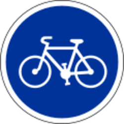
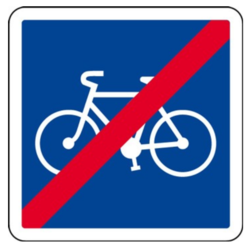
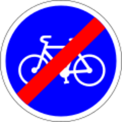
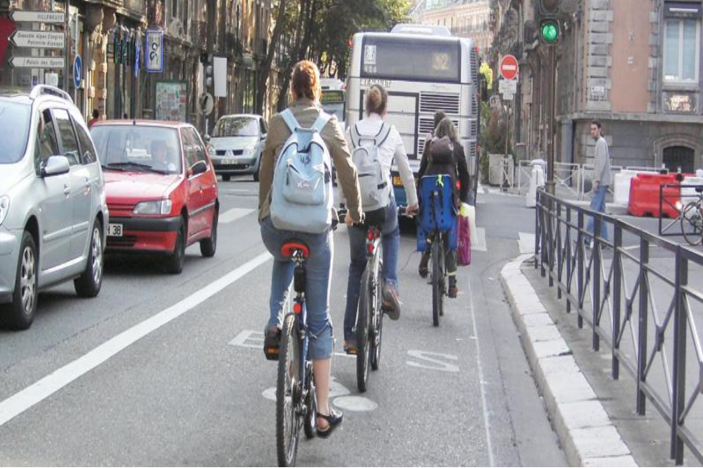
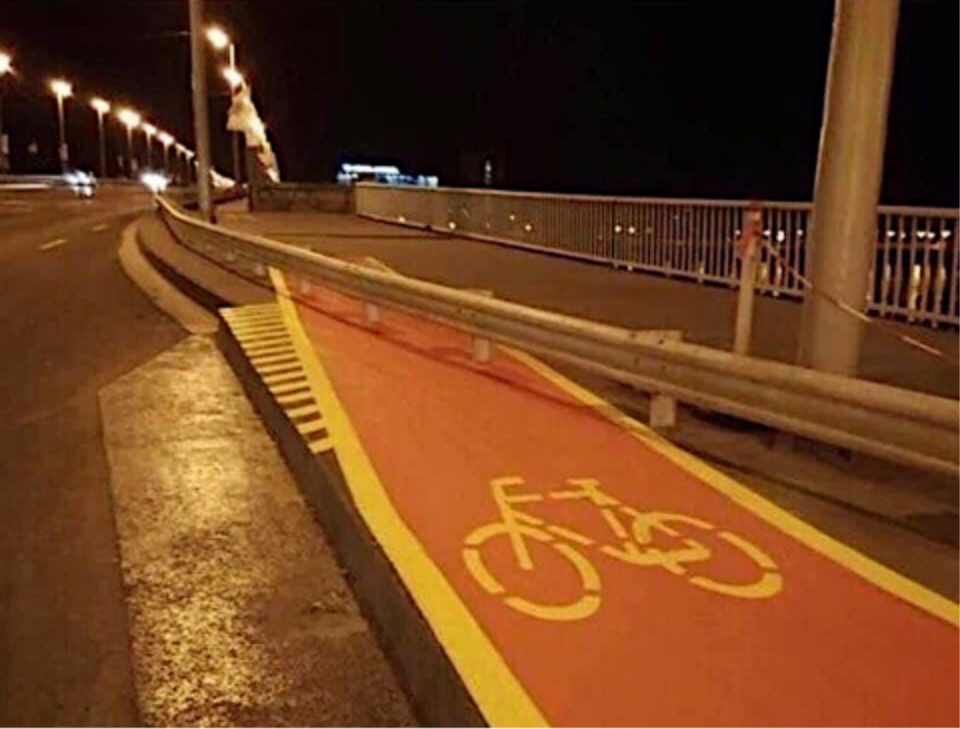
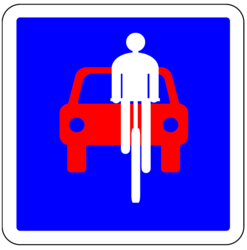
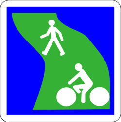
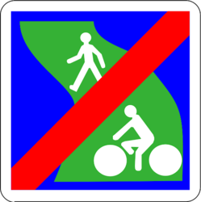

# Documentation sur les aménagements cyclables

Dans le cadre des travaux de l’équipe du Point d’accès national et de la mise en œuvre de l’ouverture des données pour améliorer l’information dont disposent les voyageurs, l’équipe de transport.data.gouv.fr, en collaboration avec l'association [Vélo & Territoires](https://www.velo-territoires.org/), propose une solution simple et structurée pour l’ouverture des données sur les aménagements cyclables : la Base Nationale des Aménagements Cyclables \(BNAC\). Elle s’adresse à toute collectivité qui souhaite se lancer dans l’ouverture d’une base décrivant ses aménagements cyclables.

Le schéma de la base de données a été co-construit avec 

* Géovélo : producteur et réutilisateur de données
* Des collectivités productrices de données :
  * Les villes d'Angers, de Brest, de Grenoble, de Montpellier, de Paris
  * Le syndicat intercommunautaire Ouest Cornouaille Aménagement
  * Les communautés de communes Touraine Vallée de l'Indre et Val d'Ille-Aubigné  
  * Les communautés d'agglomération Grand Chambéry, Pays Basque et Ventoux Comtat Venaissin 
  * La communauté urbaine Grand Poitiers
  * Les métropoles Grand Lyon et Nantes métropole
  * Les départements du Finistère et d'Ille-et-Vilaine
  * Les régions Bretagne, Île-de-France et Hauts-de-France
* Des associations et instituts : Allons à Vélo Allons à Pied \(AVAP\), Citoyens de Seignanx, Club des villes et territoires cyclables \(CVTC\), Droit au Vélo \(ADAV\) , Fédération des usagers de la bicyclette \(FUB\), Institut Paris Région, MobilityData, OpenStreetMap \(OSM\), 
* Des réutilisateurs : Mon Univert, Systra

Cinq ateliers ouverts \(le[ 27/06/2019](https://doc.transport.data.gouv.fr/documentation/liste-des-rencontres-publiques/27-06-2019-infrastructures-cyclables), le 14/04/2020, le 8/06/2020, le [8/07/2020 ](https://doc.transport.data.gouv.fr/documentation/liste-des-rencontres-publiques/08-07-2020-infrastructures-cyclables-2)et le[ 27/08/2020](https://doc.transport.data.gouv.fr/documentation/liste-des-rencontres-publiques/27-08-2020-infrastructures-cyclables-3)\) ont permis sa production. Il a notamment été établi après une enquête et plusieurs réunions du groupe de travail. Aujourd’hui disponible en version 0.1.0, il sera mis-à-jour prochainement

## Description des différents types d' aménagements et régimes de priorités 

Vous trouverez ci-dessous la définition de tous les aménagements cyclables autorisés dans les champs "ame\_d", "ame\_g"  et de certains régimes de priorités présents dans les champs "regime\_v\_d" et "regime\_v\_g" du schéma de données qui a été élaboré afin d'harmoniser les données sur les aménagements cyclables. 

Ces aménagements ne sont pas tous réglementaires et ont pour objectif de décrire la réalité du terrain sans être exhaustifs. Les définitions sont accompagnées de photos : 

* d'aménagements conformes à la définition ;
* d'aménagements non conformes à la définition ;
* des signalétiques associées à l'aménagement.

Certains aménagements, dont les aménagements non réglementaires, ne contiennent pas toutes ces illustrations. 

Ces aménagements ont été définis grâce aux définitions : 

* du Centre d'études et d'expertise sur les risques, l'environnement, la mobilité et l'aménagement \([CEREMA](https://www.cerema.fr/fr)\) ;
* de la Fédération Française des Usagers de la Bicyclette \([FUB](https://www.fub.fr/)\) ;
* de l'Association Droit au Vélo \([ADAV](https://droitauvelo.org/)\) ;
* de l'association [Vélo & Territoires ](https://www.velo-territoires.org/);

## Aménagements cyclables

### Accotement revêtu 

La désignation « accotement revêtu », que les gestionnaires de la route appellent aussi « bande multifonctionnelle », désigne une surlargeur revêtue, adjacente à la chaussée. Elle a une fonction sécuritaire. Elle permet l'arrêt d'un véhicule en panne, la récupération d’un véhicule déviant de sa trajectoire normale en autorisant des manœuvres d’urgences et facilite les intervention d'urgence. 

Elle permet également aux cyclistes de circuler en sécurité. 


**Aménagement conforme**

\*\*\*\*\*\*\*\*


### Aménagements mixtes piéton/vélo hors voie verte 

Ponctuellement, en ville, en cas de rétrécissement de l’emprise \(ouvrage d’art, point dur, émergence, etc.\), une cohabitation piétons-cyclistes peut être envisagée sur une courte distance.

**Franchissement supérieur** : sur les ponts, les emprises sont souvent limitées et obligent cette cohabitation sur un même espace. Piétons et cyclistes circulent généralement tous dans le même sens ce qui favorise la mixité et limite les risques de conflits du fait de trajectoires différentes.

**Franchissements inférieurs** : de la même manière, la mixité peut être autorisée sur une courte distance.

**Rétrécissement ponctuel** : cela oblige parfois à interrompre l’aménagement cyclable et une zone de mixité est alors préférable au renvoi du cycliste sur la chaussée.

**Carrefour** : maintenir les pistes cyclables dans les carrefours importants est généralement complexe notamment du fait des nombreux croisements avec les flux piétons.

### Bande cyclable

Une bande cyclable désigne une voie exclusivement réservée aux cycles à deux ou trois roues sur une chaussée à plusieurs voies \(Décret n° 98-828 du 14 septembre 1998, art. R110-2 \). Elle peut être unidirectionnelle ou bidirectionnelle. Il n'y a pas de séparation physique avec la chaussée mais un simple marquage au sol \(une ligne blanche discontinue T3 5u ou exceptionnellement par une ligne continue 3u\) et une signalisation verticale avec à l'entrée un panneau C113 et en sortie un panneau C114. La circulation des autres véhicules, le stationnement et la livraison y sont interdits.


**Aménagement conforme** 

  



**Signalétiques associées à cet aménagement**

**A l'entrée :** 

Panneau C113 \(usage conseillé\)          -           

               

 Panneau B22a \(usage obligatoire\)

 

                                  

    

**En sortie :**

 ****Panneau C114 \(usage conseillé\)           -    

         

Panneau B40 \(usage obligatoire\)

 


### Chaussée à voie centrale banalisée

La chaussée à voie centrale banalisée, ou « C.V.C.B. », est un aménagement particulier d’une chaussée lorsqu’il est impossible, pour des questions de largeur disponible, d’y tracer des bandes cyclables. On crée alors une voie centrale de circulation générale, banalisée car elle accueille la circulation dans les deux sens. La largeur restante est octroyée à des accotements où peuvent circuler piétons et cyclistes et permettent aux véhicules motorisés de se croiser en empiétant sur ces espaces. Cet aménagement n’a pas vocation à être d’emploi systématique mais doit rester exceptionnel. Le statut d’accotement permet en effet arrêt et stationnement des véhicules motorisés \[6, R. 417-1\], ce que ne permettent pas les bandes cyclables et pistes cyclables, La largeur minimale recommandée des accotements d’une chaussée à voie centrale banalisée est la même que celle des bandes cyclables, 1,50 m hors marquage.


**Aménagement conforme**

\*\*\*\* 



**Aménagement non conforme**

  

Une chaussée à voie centrale banalisée est équipée d’accotements. À ce titre, les figurines vélo ne doivent pas y être tracées



**Signalétique associée à cet aménagement**

Il n’y a pas, à l’heure actuelle, de panneau officiel indiquant l’entrée d’une chaussée à voie centrale banalisée, cependant on constate l’émergence de certains signaux à l’initiative des gestionnaires locaux



### Couloir ouvert bus/vélo

Un couloir bus-vélos est une voie dédiée à la circulation mixte des bus et des vélos \(arrêté préfectoral n° 01-15042\).

Le couloir bus « ouvert » a une largeur  de 3,00m à 3,50m. 


**Aménagement conforme** 

 



**Signalétiques associées à l'aménagement** 

**Au sol**  : Marquage discontinu T3 5u, alternance marquage « bus » + flèche + logo vélo

**Panneau** : Panonceau vélo apposé sous un panneau B27

  


### Double sens cyclable 

Le double-sens cyclable, ou « D.S.C. », n’est pas tant un objet qu’un concept ou une caractéristique portée par une rue. Une rue dite « en double-sens cyclable » est à double sens de circulation — ou bidirectionnelle —, mais un de ces sens est réservé aux seuls cyclistes. Les rues dont la vitesse maximale autorisée est de 30 km/h ou moins sont toutes en double-sens cyclable, sauf décision contraire de l’autorité investie du pouvoir de police. La création de l’article R. 412-28-1 étend son domaine d’emploi initialement cantonné aux zones de rencontre et zones 30.

La signalisation par marquage des double-sens cyclables se fait à l’aide de la figurine vélo accompagnée d’une flèche directionnelle. En ce qui concerne les lignes séparatrices, s’il est fait le choix d’un marquage séparatif axial, elles peuvent être discontinues du type T’1-2u ou T3-2u; ou continues 9 de largeur 2u. Si le sens réservé aux cyclistes est traité sous la forme d’une bande cyclable, la ligne séparatrice est du type « bande » T3-5u avec une surlargeur de 50 cm. En entrée de double-sens cyclable, sens réservé aux cyclistes, le panneau de sens interdit B 1 doit être complété par un panonceau M 9v2 qui lève sa prescription pour les cycles. Dans le sens de la circulation générale, un panneau C 24a pourra être utilisé pour indiquer aux usagers qu’ils croiseront des cyclistes \[18, article 72-3\]. En sortie des voies sécantes, un panneau C 24c similaire indique aux usagers que la circulation se fait dans les deux sens, avec un sens réservé aux cyclistes \(figure 2-4.b\). En sortie de double-sens cyclable, les intersections sont soumises aux régimes habituels de priorité \(figure 2-5.a\). Les marquages au sol pourront être tracés avec un rapport de réduction de 2 \[19, article 118-1 C\]. Lorsqu’un doute persiste, les panneaux de priorité pourront être complétés par un panonceau M 4d1 afin de rappeler qu’ils ne s’appliquent qu’aux cyclistes \(figure 2-5.b\).


**Aménagements conformes**

  



**Aménagement non conforme**

 

Aménagement confus : une bande cyclable est indiquée comme obligatoire. Deux panneaux C 24a la signalent comme bidirectionnelle alors qu’un panneau C 12 précise que la rue est à sens unique. La largeur de la bande est manifestement incompatible avec le croisement de cyclistes. Enfin, le débouché de la voie réservée est obstrué par un îlot qui contraint les cyclistes à se déporter face aux véhicules motorisés à l’approche.



**Signalétique associée à cet aménagement** 

**Au sol :** Ligne continue 3u sur 10m**,** flèche associée pictogramme vélo

**Panneau**  : Panneau C24a

  


### Goulotte

Aménagement qui facilite la montée et la descente d’un escalier avec un vélo à la main en le faisant rouler dans une goulotte ou sur une rampe située à droite ou à gauche de l’escalier.


**Aménagement conforme**

 


### Piste cyclable

Une piste cyclable désigne une route indépendante ou la partie d’une route destinée aux cyclistes et indiquée comme telle par des signaux. Une piste cyclable est séparée des autres routes ou des autres parties de la même route par des aménagements matériels. Ainsi, elle se traduit par une chaussée exclusivement réservée aux cycles à deux ou trois roues et aux engins de déplacement personnel motorisés \(Article R. 110-2\). Elles peuvent être unidirectionnelles, à un seul sens de circulation, ou bidirectionnelles, à deux sens de circulation. 

Les largeurs recommandées d’une piste cyclable sont de 2 m pour une piste unidirectionnelle et de 3 m pour une piste bidirectionnelle. Ces largeurs doivent être adaptées au contexte local et à la fréquentation.

 Elle est signalée à l'entrée par un panneau C113 et en sortie par un panneau C114


  **Aménagement conforme** 

  



**Aménagement non conforme** 

  



**Signalétique associée à cet aménagement**

**A l'entrée :**

Panneau C113 \(usage conseillé\)          -           

          

    

Panneau B22a \(usage obligatoire\)

    

**En sortie :**

 ****Panneau C114 \(usage conseillé\)           -    

         

Panneau B40 \(usage obligatoire\)



### Vélorue

La vélorue n’a, à l’heure de l’écriture de ce document, pas de cadre réglementaire en France. Elle existe ailleurs en Europe : en Belgique, au Danemark ou aux Pays-Bas. Plusieurs collectivités françaises dont Strasbourg, Bordeaux, Dijon ou Caen ont tout de même franchi le cap et ont transformé certaines de leurs rues en vélorues. On retrouve certains traits communs à ces voies, comme la notion de priorité du cycliste, la recherche de réduction des vitesses, et le découragement du transit. Dans certains cas, il est même interdit de dépasser les cyclistes.


**Aménagement suggéré**

 



**Signalétiques associées à cet aménagement**

La vélorue n’étant pas encore réglementée , aucune signalisation particulière n’y est associée. On constate cependant que les collectivités qui utilisent la vélorue ont recours au marquage au sol de trajectoires matérialisées pour cycles. Elles l’accompagnent d’un panneau représentant un cycliste devant une automobile, modèle semblable à celui déjà utilisé en Belgique. 



### Voie verte

Une voie verte désigne une route exclusivement réservée à la circulation d'usagers non motorisés, à savoir les piétons au sens large \(pratiquants de rollers, personnes en fauteuil roulant…\), les cyclistes et les cavaliers. Ce sont des aménagements en site propre \(séparés de la circulation motorisée\), destinés aux déplacements quotidiens et de loisirs, et souvent réalisés sur une ancienne voie de chemin de fer désaffectée, un chemin de halage, un chemin rural, un chemin forestier, etc. \(Décret n° 2004-998 du 16 septembre 2004\). Sa Largeur varie entre 3 et 5m. Elle est signalée à l'entrée par un panneau C115 et en sortie par un panneau C116


**Aménagement conforme** 

\*\*\*\*



**Aménagement non conforme**

Malgré la tentation de mélanger vélos et piétons sur un trottoir, ce dernier ne peut pas être qualifié comme une voie verte. En effet, une voie verte est un axe en site propre.



**Signalétiques associées à cet aménagement**

**A l'entrée :** Panneau C115 

 

**En sortie :** Panneau C116 

 


## Régimes de priorités

### Aire piétonne 

Les cyclistes y sont la plupart du temps admis \(c'est leur interdiction qui doit être signalée\), mais ils doivent y circuler au pas et sans gêner les piétons

Une aire piétonne désigne une section ou un ensemble de sections de voies en agglomération, hors routes à grande circulation, constituant une zone affectée à la circulation des piétons de façon temporaire ou permanente. Dans cette zone, sous réserve des dispositions de l’article R431-9 du code la route, seuls les véhicules nécessaires à la desserte interne de la zone sont autorisés à circuler à l’allure du pas et les piétons sont prioritaires sur ceux-ci. Les entrées et sorties de cette zone sont annoncées par une signalisation. 


**Aménagement conforme**

 



**Signalétique associé à l'aménagement** 

**A l'entrée  :** Panneau B54

 

**En sortie :** Panneau Panneau B55 



### Zone de rencontre 

Une zone de rencontre désigne une section ou un ensemble de sections de voies en agglomération constituant une zone affectée à la circulation de tous les usagers. Dans cette zone, les piétons sont autorisés à circuler sur la chaussée sans y stationner et bénéficient de la priorité sur les véhicules. La vitesse des véhicules y est limitée à 20 km/h. Toutes les chaussées sont à double sens pour les cyclistes, sauf dispositions différentes prises par l’autorité investie du pouvoir de police. Les entrées et sorties de cette zone sont annoncées par une signalisation et l’ensemble de la zone est aménagé de façon cohérente avec la limitation de vitesse applicable.


**Signalétique associée à l'aménagement**

**A l'entrée** : Panneau B52 :

 

**En sortie :** Panneau B53 

 


### Zone 30

Une zone 30 désigne une section ou un ensemble de sections de voies constituant une zone affectée à la circulation de tous les usagers. Dans cette zone, la vitesse des véhicules est limitée à 30 km/h. Toutes les chaussées sont à double sens pour les cyclistes, sauf dispositions différentes prises par l’autorité investie du pouvoir de police. Les entrées et sorties de cette zone sont annoncées par une signalisation B30 et B51, et l’ensemble de la zone est aménagé de façon cohérente avec la limitation de vitesse applicable.


**Signalétique associée à l'aménagement** 

**A l'entrée :** Panneau B30 :

 

**En sortie :** Panneau B51 

 


### 

